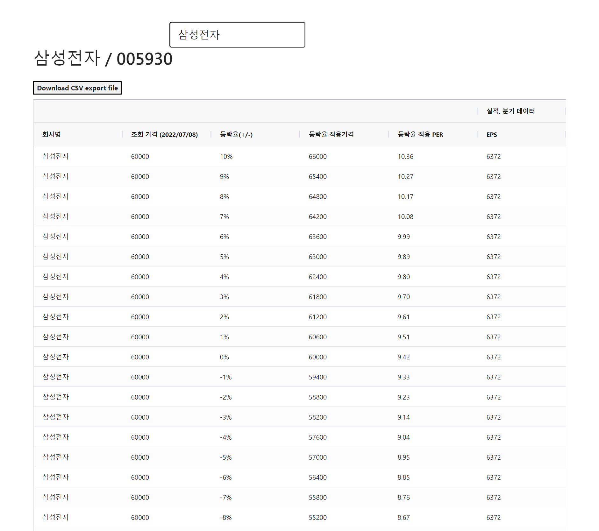

# 한국주식 데이터 뷰어

### 목표

- 예상 매수 평단가 계산
- 분기별 어닝 로그 + 컨센서스 뷰어

### 모듈 구성 계획 

#### backend

- config-server
  - 지금 당장 여러 인스턴스 띄워둔 것에 대해 현금을 쓰기에는 개인 사정상 불리해서 패스
  - 멀티모듈은 일단 구비해둠
- ticker-api
  - webflux, r2dbc, reactive redis 기반의 레디스 검색 모듈
  - 종목검색에 특화한 모듈
  - 티커에 대한 REST API 뿐만 아니라 코드레벨 상의 API 역시 제공
- earnings-api
  - in memory h2
  - docker: redis, kafka, jookeeper
  - coroutine
  - 분기별 실적/컨센 데이터 없으면 크롤링, 있으면 레디스 조회
  - 1분에 한번씩 모든 한국주식에 대한 실적 데이터 크롤링 & 레디스 update

#### frontend

vuejs 도 쓸줄안다..!!! 그냥 vuejs 쓸까 고민중이긴 하다.

일단은 React 로 해야한다고 생각은 하고 있다.

예를 들면 아래와 같은 화면을 개발하려고 생각중이다.

위와 같은 영역을 하나의 div 로 엮어서 원하는 종목들에 대해 실적데이터와 그래프를 함께 보여주는 기능이다.

 

### 추가계획

작년 6월 \~ 8월 사이 언제쯤엔가 `stock-cells-kr` 라는 프로젝트를 했었다. 매수 평단가 측정하는 용도의 앱이었다. 

> '내가 현금이 얼마 있을 때 어느 정도를 사서 이 정도 평단가에 이번 분기에 사겠다.'

이런 아이디어를 애플리케이션에 옮겨두려고 했다. 자꾸 매수를 거듭하는 강박적인 매매 말고, 계획을 세워두고 절제하게끔 하는 애플리케이션을 개발하려고 했다. 

이 프로젝트를 하면서 react 도 처음부터 다시 시작했었다. 예전이랑 너무 많이 달라져서 처음부터 공부했었다. 

리덕스도 옛날에 배울때는 컴포넌트 기반으로 배웠다가 어? 이거 아니네? 하면서 새로 만들때는 redux 공식 페이지 예제를 보고 함수형 리덕스로 새로 공부해서 적용했었었다. 

이때 만들었던 backend, frontend 의 결과화면이다. 

의외로 종목 검색을 elastic search 없이 한다는게 꽤 빡신 작업이었다. 

지금은 매수 평단가 이런 것보다는 실적을 차트로 정리해두는 그런 앱을 만들어보려고 한다.

`stock-cells-kr` 은 잠시 버려둘까? 하고 생각중이다 ㅋㅋ

설날동안 잠깐 어떻게 뭔가 만들어보기엔 stock-cells-kr 은 너무 헤비하다. 그냥 나 혼자 엑셀에 계획세우면 된다는 생각이...

그냥 이번 설에는 실적 데이터, 컨센만 차트로 뿌리는 프로그램을 작성할까 생각중이다.