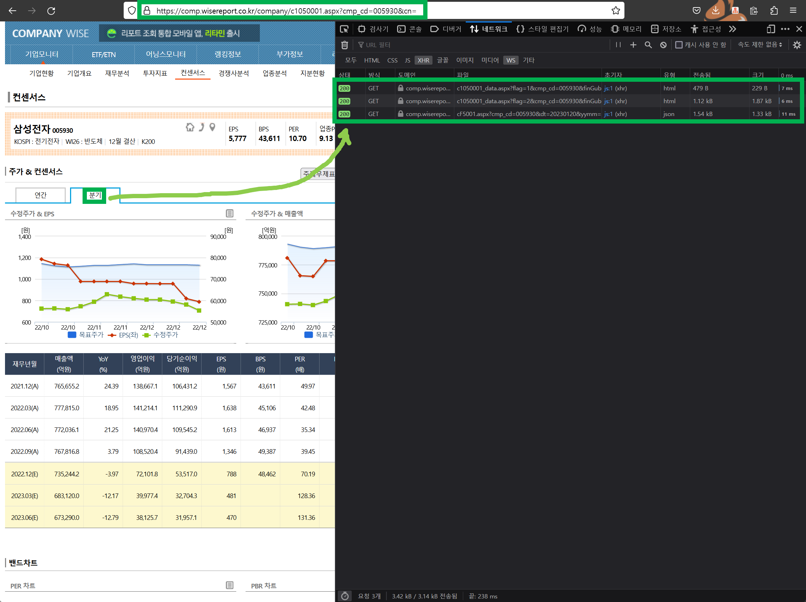

# 실적데이터 크롤링 참고자료

참고

- [CompanyWise](https://comp.wisereport.co.kr/company/c1050001.aspx?cmp_cd=005930)
- [CompanyWise - 기업모니터/컨센서스](https://comp.wisereport.co.kr/company/c1050001.aspx?cmp_cd=005930&cn=)

 

FnGuide, 네이버 증권 모두 사용해봤지만, 크롤링할 수 있는 방법이 뚜렷하지 않았다. 왜냐하면버튼 클릭 시 엘리먼트를 동적으로 그리게끔 만들어두었기에 selenium 계열의 e2e 라이브러리를 사용해야 했다. selenium 을 사용하게 되면 이벤트 중간 중간마다 적당한 delay 를 주고, 블로킹 기반으로 실행해야 하는데 일단은 더 좋은 다른 방식이 있는지를 찾는게 낫겠다 싶었다. 

그래서 찾게 된 것은 wisereport 다.

구글 검색창에서 검색하다보니 wisereport가 나타났었다.

[CompanyWise - 기업모니터/컨센서스](https://comp.wisereport.co.kr/company/c1050001.aspx?cmp_cd=005930&cn=) 

 

위에서 호출하는 api를 활용하면 된다. 이 방식은 단점이 하나 있는데, API 요청시 header 로 마무리 application/json 으로 해서 요청하더라도 응답은 강제적으로 `text/html; utf-8` 로 내려온다는 점이다.  

그래서 그냥 String 데이터로 받은 후에 커스텀하게 Deserialize 하는 방식으로 해결했다. 

 

나중에 까먹었을 때를 대비해서 정리했다.